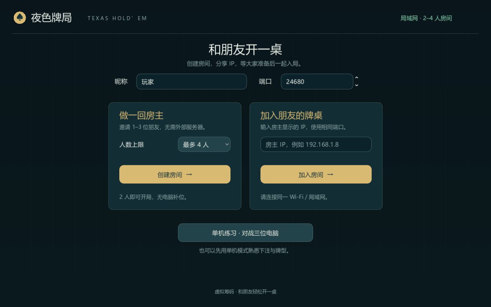

# 夜色牌局 · 德州扑克

Godot 4 中文德州扑克小游戏，支持 **2–4 人局域网房间**和单机练习。每人初始 1,000 筹码，盲注固定 10 / 20，赢下全部筹码即可获胜。所有筹码均为虚拟筹码。



## 开始游戏

从 [v1.0.0 Release](https://github.com/Eser-Tired/TexasHoldem/releases/tag/v1.0.0) 下载：

- **Windows x64**：运行 `NightfallPoker-v1.0.0-Windows-x64.exe`，游戏资源已内嵌，无需安装 Godot。
- **Android 7.0 及以上**（设备支持 OpenGL ES 3.0）：安装 `NightfallPoker-v1.0.0-Android.apk`，横屏游玩。支持 ARM64、ARMv7 和 x86_64，APK 使用正式发布密钥签名。
- `SHA256SUMS.txt` 提供两个文件的 SHA-256 校验值。

Windows 与安卓可以连接同一局域网房间。所有人使用相同游戏版本。

从源码运行：安装 Godot 4（已验证 4.7.2），下载项目，双击 `开始游戏.cmd`。启动器会查找 WinGet 安装路径或 PATH 中的 Godot，先导入项目资源与脚本，再打开游戏；也可在 Godot 中导入 `project.godot` 并按 F5 运行。不需要 Python 或插件。

编辑项目：双击 `打开编辑器.cmd`，或者在 Godot 项目管理器中导入 `project.godot`，按 F5 运行。

## 局域网联机

1. 所有人连接同一 Wi-Fi 或局域网，使用同一版本的项目。
2. 房主填写昵称、端口和人数上限（2–4），点击 **创建房间**。默认端口为 **UDP 24680**。
3. 房主将房间里显示的局域网 IP 和端口告诉朋友。若有多个网卡，选择与朋友处于同一网络的 IP。
4. 其他人填写昵称、房主 IP 和相同端口，点击 **加入房间**，再点击 **准备**。
5. 房间至少两人，所有人准备后，房主点击 **开始对局**。未坐满也可开局，不加入电脑补位。
6. 每个人在自己的底部座位操作；房主负责发牌、校验下注和结算。每手结束由房主开始下一手；出局玩家可以继续观看，直到整局结束。

第一次运行时若 Windows 提示防火墙权限，请允许游戏访问 **专用网络**。无法连接时，检查 IP、端口、是否同一网络，以及路由器是否启用了访客网络 / 客户端隔离。房间在开局后关闭新玩家加入，连接在 8 秒后超时并允许重新尝试。

房主离开会关闭房间。其他玩家离开或断线时，当前对局结束，剩余玩家返回房间；重新准备开局后，筹码重置为 1,000。暂不支持继续断线前的牌局或房主迁移。

本机测试：打开多个游戏窗口，房主创建房间，其他窗口填写 `127.0.0.1` 和相同端口即可加入。默认端口被占用时可改用其他端口。

## 单机练习

大厅点击 **单机练习**，与三名电脑对战。电脑按可见牌采样胜率，结合底池赔率和性格选择行动，不读取对手底牌。可随时返回大厅切换联机。

## 操作

- 空格：过牌、跟注；结算后开始下一手（联机时仅房主可操作）。
- F：弃牌；R：按输入框金额加注。
- **直接输入整数筹码**，点击「加注」执行。回车仅确认数值并收起键盘；不会直接下注。输入时，F / R / 空格不会触发行动。
- 输入金额是**本轮下注总额**。例如本轮已投入 20，输入 125 后加注，会再扣 105。小于最小加注、超过可用筹码、负数、小数和空值均不会下注。
- 桌面端的滑块与「最小 / ½ 池 / 满池」会同步到输入框；安卓使用更大的按钮和数字输入框。
- 全下：投入全部剩余筹码。
- F11：全屏切换；Esc：关闭玩法说明或退出金额编辑。安卓返回键关闭说明 / 键盘，或返回大厅。
- 顶部按钮：查看玩法、开关提示音、重新开局（联机时仅房主可操作）和离开房间 / 返回大厅。

## 已实现

- 翻牌前、翻牌、转牌、河牌下注；庄家轮转；出局玩家跳过；两人桌盲注与行动顺序。
- 九类牌型比较、皇家同花顺、A2345 顺子、踢脚牌、用公共牌组成最佳牌。
- 最小加注、短筹码跟注全下、不足额全下后的加注权、累计短加注重新开放行动。
- 自动跑完全下公共牌、边池独立结算、平分底池、零头顺序、未跟注金额退回。
- 房间创建 / 加入、昵称、人数上限、准备 / 取消准备、房主开始、断线处理与连接超时。
- 房主校验身份、行动轮次、状态版本和下注金额；客户端无法替别人行动、重复提交过期操作或控制下一手。
- 各玩家分别接收自己的底牌与公共信息；未摊牌的对手底牌、弃牌玩家底牌和牌堆不会发送给其他客户端。
- 中文牌桌、手牌揭示、发牌动效、行动提示、历史记录和简单合成音效。

这是固定盲注的短局游戏，未加入互联网房间发现、存档和锦标赛升盲。

## 文件

- `scripts/poker_rules.gd`：纯牌型与边池计算。
- `scripts/poker_table.gd`：牌局状态机、下注规则和电脑策略。
- `scripts/main.gd`：牌桌绘制、按钮、键盘、音效。
- `scripts/lan_room.gd`：ENet 房间、准备状态、房主权威 RPC、个性化快照。
- `scripts/poker_view.gd`：客户端只读牌局视图。
- `scripts/menu.gd`：房间大厅与单机入口。
- `scenes/main.tscn`：主场景。
- `scenes/menu.tscn`：启动大厅。
- `tests/test_poker.gd`：已知牌型、600 组七张牌穷举比较、边池、下注边界、500 手随机模拟和 60 手电脑策略对局。
- `tests/test_ui.gd`：精确金额、无效输入、滑块 / 快捷金额同步、回车与键盘焦点、场景按钮、弹窗暂停、全下和字体验证。
- `tests/test_menu.gd`：创建房间按钮、人数选择、错误 IP 与单机入口。
- `tests/test_lan_rules.gd`：2–4 人规则、座位旋转、底牌隔离与观战。
- `tests/Run-LanTests.ps1`：多进程真实 ENet 通信，分别验证 2、3、4 人房间。
- `tests/test_lan_admission.gd`：容量、准备、超时、中途加入、协议版本、重新加入与房主离开。
- `docs/NETWORKING.md`：联机设计。
- `export_presets.cfg`：Windows 内嵌资源和 Android 正式 APK 导出配置。
- `tools/Build-Release.ps1`：导出两个平台、使用私有签名并生成校验值。
- `docs/BUILDING.md`：导出工具配置与发布密钥管理。

## 验证

在此目录用 Godot 控制台程序运行：

```powershell
godot_console --headless --editor --import --quit --path .
godot_console --headless --path . --script res://tests/test_poker.gd
godot_console --headless --path . --script res://tests/test_ui.gd
godot_console --headless --path . --script res://tests/test_ui.gd -- --touch-layout
godot_console --headless --path . --script res://tests/test_menu.gd
godot_console --headless --path . --script res://tests/test_lan_rules.gd
godot_console --headless --path . --script res://tests/test_lan_admission.gd
powershell -NoProfile -ExecutionPolicy Bypass -File tests/Run-LanTests.ps1
```

无需插件；牌桌、扑克牌和图标随项目提供。中文与花色字形使用内置 Noto Sans SC 字体，遵循 [SIL Open Font License](assets/fonts/OFL.txt)，来源为 [Google Fonts](https://github.com/google/fonts/tree/main/ofl/notosanssc)。安装包内包含字体许可文本。
